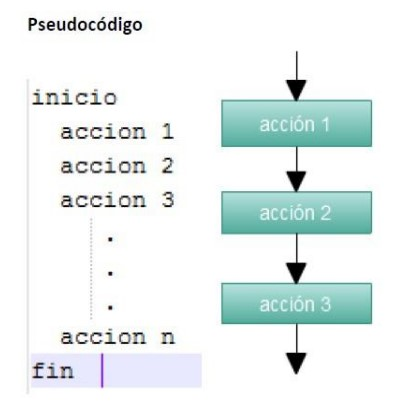

# Programación (Fundamentos y Logica)
# Lección 3:

* ¿QUÉ ES EL PSEUDOCÓDIGO Y POR QUÉ VAMOS A UTILIZARLO?
* PROGRAMA 
* DISEÑO DEL PROGRAMA
* ESPECIFICACIONES DE UN PROGRAMA
* CODIFICACIÓN
* ¿CÓMO DEBEN ESCRIBIRSE LOS ALGORITMOS/PROGRAMAS?
* CABECERA DEL PROGRAMA
* ¿QUÉ ELEMENTOS POSEE UN PROGRAMA?
* IDENTIFICADORES
* ¿Y si necesitamos un identificador de más de una palabra?


## ¿QUÉ ES EL PSEUDOCÓDIGO Y POR QUÉ VAMOS A UTILIZARLO?

El lenguaje de programación que utilizaremos en esta parte del curso, para representar nuestros algoritmos es el pseudocódigo.
El pseudocódigo es una herramienta de programación en la que las instrucciones se escriben en palabras similares al inglés o español, que facilitan tanto la escritura como la lectura de programas.
En esencia, el pseudocódigo se puede definir como un lenguaje de especificaciones de algoritmos. El uso de tal lenguaje hace el paso de codificación final (esto es, la traducción a un lenguaje de programación) relativamente fácil. El pseudocódigo se considera un primer borrador, dado que tiene que traducirse posteriormente a un lenguaje de programación.

## PROGRAMA 

En los apartados anteriores, explicamos que es la programación y que está compuesta de dos partes, los lenguajes de programación y los algoritmos, pero, ¿donde se van a ver reflejados estos dos conceptos? Estos se van a ver reflejados en nuestro programa.

Un programa no es más que una serie de algoritmos escritos en algún lenguaje de programación de computadoras. Un programa es, por lo tanto, un conjunto de instrucciones — órdenes dadas a la computadora— que producirán la ejecución de una determinada tarea. En esencia, un programa es un medio para conseguir un fin. El fin será probablemente definido como la información necesaria para solucionar un problema.

## DISEÑO DEL PROGRAMA

Se puede utilizar algunas de las herramientas de representación de algoritmos, también conocidos como lenguajes de programación, para definir la secuencia de pasos que se deben llevar a cabo para conseguir el resultado que necesitamos.

## ESPECIFICACIONES DE UN PROGRAMA

Tras la decisión de desarrollar un programa, el programador debe establecer el conjunto de especificaciones que debe contener el programa: entrada, salida y algoritmos de resolución, que incluirán las técnicas para obtener las salidas a partir de las entradas. Un programa puede ser lineal (secuencial) o no lineal. Un programa es lineal si las instrucciones (acciones) se ejecutan secuencialmente como los ejercicios propuestos en esta guía, es decir, sin bifurcaciones, decisión ni comparaciones. 



Estructura de un programa secuencial

## CODIFICACIÓN

Una vez que tenemos las especificaciones de un programa pasaremos a la codificación del programa. 
La codificación es la operación de escribir la solución del problema (de acuerdo a la lógica del pseudocódigo), en una serie de instrucciones detalladas, en un  ódigo reconocible por la computadora. 
La serie de instrucciones detalladas se conoce como código fuente, el cual se escribe en un lenguaje de programación o lenguaje de alto nivel. 


## ¿CÓMO DEBEN ESCRIBIRSE LOS ALGORITMOS/PROGRAMAS?

Ya sabemos que es un programa, el diseño de un programa, las especificaciones de un programa y su codificación. Ahora vamos a ver como es la escritura de estos algoritmos / programas. 
Un algoritmo consta de dos componentes: una cabecera de programa y un bloque algoritmo. La cabecera de programa es una acción simple que comienza con la palabra algoritmo. 
Esta palabra estará seguida por el nombre asignado al programa completo.

El bloque algoritmo es el resto del programa y consta de dos componentes o secciones: las acciones de declaración y las acciones ejecutables.
Las declaraciones definen o declaran las variables que tengan nombres.

Las acciones ejecutables son las acciones que posteriormente deberá realizar la computación cuando el algoritmo convertido en programa se ejecute.

algoritmo
cabecera del programa
sección de declaración
sección de acciones

## CABECERA DEL PROGRAMA
Todos los algoritmos y programas deben comenzar con una cabecera en la que se exprese el identificador o nombre correspondiente con la palabra reservada que señale el lenguaje. En PSeInt, la palabra reservada es Algoritmo.

```javascript
Algoritmo sin_titulo
/* Acciones */
FinAlgoritmo
```

Donde la palabra sin título debe ser reemplazada por el nombre del algoritmo. 

## ¿QUÉ ELEMENTOS POSEE UN PROGRAMA?
Los elementos de un programa, son básicamente, los componentes que conforman las instrucciones previamente mencionadas, para crear nuestro programa y resolver sus problemas.

Estos elementos siempre estarán dentro de un algoritmo.
Los elementos de un programa son: identificadores, variables, constantes, operadores, palabras reservadas.

## IDENTIFICADORES

Un identificador es un conjunto de caracteres alfanuméricos de cualquier longitud que sirve para identificar las entidades del programa (nombre del programa, nombres de variables, constantes, subprogramas, etc.). 

En PseInt los identificadores deben constar sólo de letras, números y/o guión_bajo(_), comenzando siempre con una letra y se suelen escribir siempre en minúsculas.

Estos tampoco pueden contar de tildes, ni de la letra Ñ, ya que generaría errores.

Otra cosa que es súper importante a la hora de pensar identificadores, es poner nombres claros, por ejemplo, si queremos tener una frase, que el identificador sea frase o si queremos una suma, le pondremos suma. 

## ¿Y si necesitamos un identificador de más de una palabra?

Ahora, si queremos poner un identificador que sea de más de una palabra, usamos algo llamado camelCase, consiste en poner la letra de la segunda palabra en mayúsculas, por ejemplo, queremos que el identificador refleje que suma números, le pondríamos sumaNumeros, la segunda palabra arranca con la N en mayúsculas. 

De está manera, mantenemos la regla de escribir siempre en minúsculas.

Esto no es solo para la segunda palabra, si queremos poner una tercera o una cuarta palabra, etc. haríamos lo mismo. Por ejemplo,sumaNumerosEnteros, para un identificador más claro.
