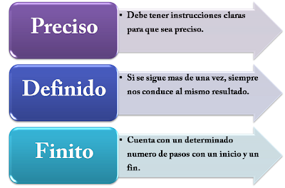

# Programación (Fundamentos y Logica)
# Lección 7:

* Características de un algoritmo Intro
* Las características de un algoritmo
* Elementos para construir un algoritmo
* Variables y Constantes
* Constante
* Variable
* Datos
* Operadores aritméticos
* Operadores relacionales
* Operadores lógicos
* Comandos
* Clasificación de los algoritmos

## Características de un algoritmo Intro

Un algoritmo es una serie de reglas que posibilita obtener un resultado mediante una sucesión de pasos. Los algoritmos se pueden expresar de diversas formas, eso incluye diagramas de flujo, el lenguaje de programación, el lenguaje natural, el pseudocódigo, entre otros.

A pesar de que no existe un consenso para definir formalmente lo que es un algoritmo, este puede ser explicado como un grupo finito de operaciones que son organizadas de una manera ordenada y lógica, mediante la que es posible la solución de un problema determinado.

En lo cotidiano son suelen emplear algoritmos de manera frecuente para solucionar problemas, como, por ejemplo, para utilizar un aparato por primera vez, es necesario seguir las instrucciones de un manual o para un empleado hacer un trabajo recibe las indicaciones por parte de su jefe. En las matemáticas, algunos ejemplos son el algoritmo de la división para poder calcular el cociente entre dos números, o en la multiplicación, para calcular el producto.

##  Las características de un algoritmo

Los algoritmos tienen características fundamentales, estas son:

Un algoritmo tiene que ser finito: un algoritmo necesita tener un determinado número de los pasos seguidos.

Un algoritmo tiene que definir tres partes: una entrada, el proceso y la salida

Un algoritmo necesita ser preciso: debe dar indicación del orden en el que se necesita realizar cada uno de los pasos a seguir para llegar a una solución.

Un algoritmo tiene que ser legible: tiene que haber claridad en el texto que describe el al algoritmo, de tal manera que sea posible leerlo y entenderlo con facilidad.

Un algoritmo tiene que estar definido: sin importar que un algoritmo sea seguido dos veces, el resultado deber ser el mismo en cada ocasión.

##  Elementos para construir un algoritmo

Los elementos que se utilizan para construir un algoritmo son variables y constantes, datos, comandos, y operadores:

##  Variables y Constantes

Las variables y constantes son espacios de memoria que se crean para la contención de valores que pueden variar o desean mantenerse, dependiendo de su naturaleza.

##  Constante

La constates es un dato que solo tiene un valor durante el desarrollo del algoritmo. Se utiliza cunado es necesario que un valor se mantenga mientras se ejecuta un determinado programa.

##  Variable

Es un dato cuyo valor puede variar durante el desarrollo de un programa o del algoritmo.

##  Datos

Un dato puede tratarse de una letra, un número, un signo ortográfico o cualquier símbolo que pueda representar una palabra, descripción, cantidad o medida. Estos son capaces de comunicar un significado. Pueden ser lógicos, carácter o numéricos.

##  Operadores aritméticos

Se utilizan para la construcción de fórmulas matemáticas.

##  Operadores relacionales

Se utilizan para expresar las condiciones de los algoritmos.

##  Operadores lógicos

Son utilizadas en los programas en los que es necesario evaluar y conocer si los valores constantes o variables cumplen con determinadas condiciones.  Una expresión lógica puede ser falsa o verdadera.

##  Comandos

Los comandos son todos los lenguajes computacionales o naturales utilizados, que contienen palabras que denotan una acción determinada. Cada uno de los comandos tiene una determinada sintaxis, o sea, la manera en que se utiliza.

##  Clasificación de los algoritmos

Los algoritmos se clasifican de la siguiente manera: no computacional, computacional, cuantitativo y cualitativo.

Algoritmo no computacional: es aquel algoritmo que no precisa de una computadora para su ejecución, como, por ejemplo, la instalación de un equipo de sonido.

Algoritmo computacional: es un algoritmo que puede ejecutarse desde una computadora, como, por ejemplo, la fórmula que se aplica para poder calcular la raíz cuadrada de un determinado valor.

Algoritmo cuantitativo: el algoritmo cuantitativo es aquel en el que sus instrucciones o pasos si involucran cálculos numéricos, como, por ejemplo, encontrar el resultado a una ecuación de segundo grado.

Algoritmo cualitativo: este tipo de algoritmo consiste en que sus instrucciones, reglas o pasos no se encuentran involucrados con cálculos numéricos, como, por ejemplo, al momento del desarrollo de una determinada actividad física o en la búsqueda de un tesoro.

