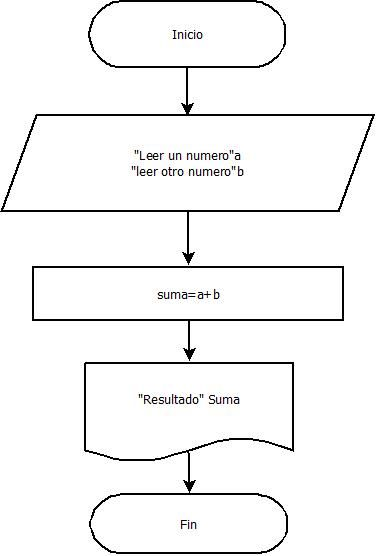
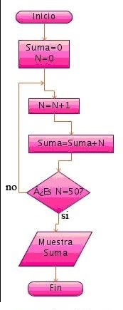

# Programación (Fundamentos y Logica)
# Lección 2:

* DIAGRAMAS DE FLUJO Intro
* ¿Qué es un Diagrama de Flujo?
* Cómo Hacer un Diagrama de Flujo
* Para qué se usan los Diagramas de Flujo
* Reglas y Símbolos en los Diagramas de Flujo.
* Ejemplos de Diagramas de Flujo
* Símbolos comunes de los diagramas de flujo

## DIAGRAMAS DE FLUJO Intro

El diagrama de flujo es una herramienta muy útil para mejorar los procesos de trabajo.

Mapear e investigar los procesos es importante para descubrir cómo se pueden mejorar.

Los diagramas de flujo son fáciles de crear y dado que las formas son simples y visuales, también son fáciles de entender.

## ¿Qué es un Diagrama de Flujo?

Un diagrama de flujo, también llamado Flujograma de Procesos o Diagrama de Procesos, representa la secuencia o los pasos lógicos (ordenados) para realizar una tarea mediante unos símbolos.

Dentro de los símbolos se escriben los pasos a seguir.

Los diagramas de flujo representan la secuencia lógica o los pasos que tenemos que dar para realizar una tarea mediante unos símbolos y dentro de ellos se describen los pasos ha realizar.

Un diagrama de flujo debe proporcionar una información clara, ordenada y concisa de todos los pasos a seguir.

Por lo dicho anteriormente, podríamos decir que: "Un diagrama de flujo es una representación gráfica o simbólica de un proceso".

El proceso o pasos que representa el diagrama de flujo puede ser de cualquier tipo, desde los pasos para freír un huevo, como luego veremos, hasta los pasos para realizar un enorme programa informático.

Muchas veces antes de realizar un diagrama de flujo se realiza un "Algoritmo" del problema o proceso a desarrollar.

Un algoritmo describe una secuencia de pasos escritos para realizar un tarea.

El Diagrama de Flujo es su representación esquemática.

Algoritmo: Escribir los pasos ordenados a realizar para solucionar el problema.

Diagrama de Flujo: Representación mediante un esquema con símbolos del algoritmo.

Los diagramas de flujo son una excelente herramienta para resolver problemas, comprender el proceso a seguir así como para identificar posibles errores antes del desarrollo final de la tarea.

## Cómo Hacer un Diagrama de Flujo

Normalmente para realizar un diagrama de flujo primero se hace el algoritmo.

Un ejemplo para cocinar un huevo para otra persona sería:

- Pregunto si quiere el huevo frito.
- Si me dice que si, lo frio, si me dice que no, lo hago hervido.
- Una vez cocinado le pregunto si quiere sal en el huevo.
- Si me dice que no, lo sirvo en el Plato, si me dice que si, le hecho sal y después lo sirvo en el plato.

Si te fijas los pasos no pueden cambiar su posición.

Sería imposible preguntarle si lo quiere frito después de haberlo hervido, por ejemplo.

Es muy importante que los pasos sean una secuencia lógica y ordenada.

Ahora que ya sabemos todos los pasos, mediante el algoritmo, podemos hacer un esquema con estos pasos a seguir.

Este esquema será el Diagrama de Flujo.

Si uno tiene experiencia puede prescindir del algoritmo escrito pero siempre tendremos que tenerlo en mente para hacer el diagrama de flujo sin equivocarnos.

Más abajo te dejamos varios ejemplos de diagramas de flujo.

## Para qué se usan los Diagramas de Flujo

Se usan para hacer un programa informático, para analizar lo que tiene que hacer un robot, en los procesos industriales, etc.

Un diagrama de flujo es útil en todo aquello que se necesite una previa organización antes de su desarrollo.

En la realización de un programa informático es imprescindible primero realizar el diagrama de flujo, independientemente del lenguaje de programación que usemos después.

Una vez que tenemos nuestro diagrama de flujo solo tendremos que conocer las órdenes del lenguaje que realizan esas tareas que se especifican en el diagrama

## Reglas y Símbolos en los Diagramas de Flujo.

1. Todos los símbolos han de estar conectados

2. A un símbolo de proceso pueden llegarle varias líneas

3. A un símbolo de decisión pueden llegarle varias líneas, pero sólo saldrán dos (Si o No, Verdadero o Falso).

4. A un símbolo de inicio nunca le llegan líneas.

5. De un símbolo de fin no parte ninguna línea.

Los símbolos que se usan para realizar los diagramas de flujo son lo siguientes:

 En el Símbolo de decisión puede tomar los valores de salida SI o NO o también VERDADERO o FALSO.

- El símbolo de Inicio o Final del Diagrama puedes ser un cuadrado con los bordes redondeados o una elipse.

- Se pueden utilizar colores para lo símbolos.

## Ejemplos de Diagramas de Flujo

Veamos un primer ejemplo muy sencillo.

Queremos hacer un programa informático que nos sume dos número y nos de el resultado en pantalla.

Solución del ejemplo:

El símbolo de resultado es un símbolo usado en los diagramas para soluciones con el ordenador.

Es el símbolo de salida del resultado por la pantalla del ordenador.

Ves que es muy sencillo, hay que ir poniendo los pasos lógicos que se deben seguir para realizar la tarea o el programa.

En el ejercicio tenemos el inicio y el fin, una entrada de datos, para meter los 2 números, una operación a realizar, la suma, y un resultado a mostrar.

Cada uno de esos pasos con su símbolo correspondiente en el diagrama.

Otro ejemplo de un diagrama de flujo para una operación sencilla.

Imaginemos que tenemos una lámpara o bombilla y queremos hacer el diagrama de flujo para saber que hacer cuando la lámpara no funciona.

¿Hacemos otro?

Bueno vamos hacer uno que nos muestre el resultado del área de un triángulo en pantalla.

Como ves, en este ni siquiera hemos puesto las operaciones dentro de los símbolos, ya que con la forma del símbolo ya se entiende.

No hemos usado mucho el símbolo de tomar un decisión, por eso vamos hacer uno en el que nos diga si el número es par o impar:

La palabra "mod" significa dividir, por lo tanto "mod 2" es dividir entre 2.

Como ya debes saber si divido un número entre 2 y el resto es 0 el número es par, en caso contrario sería impar.

Hay tenemos la decisión.

¿Al dividirlo entre 2 el resto es 0? Hay 2 posibilidades.

Si lo es, se ve en pantalla "Si es par", si no lo es, se ve en pantalla "No es par".

Eso es la toma de decisiones.

Toma una salida en función del resultado de la entrada.

Además los diagramas de flujo no solo valen para informática, incluso podemos hacer uno para cocinar un huevo, como vimos al principio.

Bueno ahora hagamos uno un poco más complicado.

Tenemos que hacer un diagrama de flujo para mostrar la suma de los 50 primeros números.

Lo primero es poner a cero la suma y dar el primer número a sumar que será el 0.

Fíjate que el diagrama acaba cuando N, que es el número en cada momento, es 50.

Mientras no sea 50 el programa vuelve a la tercera secuencia que será sumarle un número al anterior N = N + 1.

Intenta comprenderlo y ver lo que hace.

Puedes realizar mentalmente el diagrama para el número 0 y verás como lo acabas entendiendo.

## Símbolos comunes de los diagramas de flujo

Estas figuras y símbolos para diagramas de flujo son algunos de los más comunes que encontrarás en la mayoría de los diagramas de flujo.

