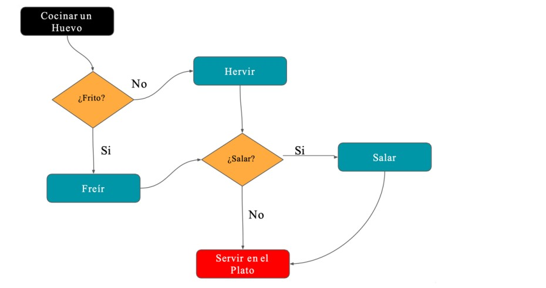

# Programación (Fundamentos y Logica)
# Lección 1:

* ¿QUÉ ES LA PROGRAMACIÓN?
* ¿QUÉ ES UN LENGUAJE DE PROGRAMACIÓN?
* ¿QUÉ ES UN ALGORITMO?
* CARACTERÍSTICAS FUNDAMENTALES DE LOS ALGORITMOS
* ¿CÓMO REPRESENTAR UN ALGORITMO?

## ¿QUÉ ES LA PROGRAMACIÓN?

La programación es el acto de programar, es decir, organizar una secuencia de pasos ordenados a seguir para hacer cierta cosa. Este término puede utilizarse en muchos contextos. Por ejemplo, programar una salida con amigos, organizar unas vacaciones, etc.
En informática el término programación se refiere a la acción de crear programas y programar es la serie de instrucciones, que le vamos a dar a nuestra máquina, para lograr lo que nuestro programa necesite para funcionar. 

Las partes que componen a nuestro programa son el lenguaje de programación y los algoritmos.

Vamos a programar una alarma en el celular. Deberás entrar a su celular y poner una alarma para que suene a la hora en la que debes conectarte a tu clase, lo importante es que vean como al celular le damos una serie de instrucciones para realizar una tarea, que sería, hacer ruido a una hora que nosotros decidamos. 

## ¿QUÉ ES UN LENGUAJE DE PROGRAMACIÓN?

Es un lenguaje formal que, mediante una serie de instrucciones, le permite a un programador escribir un conjunto de órdenes, acciones consecutivas datos y algoritmos para, de esa forma, resolver problemas. Las instrucciones que sigue la computadora para la creación de programas están escritas en un lenguaje de programación y luego son traducidas a un lenguaje de máquina que puede ser interpretado y ejecutado por el hardware del equipo.

Hay distintos tipos de lenguajes de programación:

• Lenguaje máquina: Es el más primitivo de los lenguajes y es una colección de dígitos binarios o bits (0 y 1) que la computadora lee e interpreta y son los únicos idiomas que las computadoras entienden. Ejemplo: 10110000 01100001

• Lenguajes de alto nivel: Tienen como objetivo facilitar el trabajo del programador, ya que utilizan unas instrucciones más fáciles de entender.
Además, el lenguaje de alto nivel permite escribir códigos mediante idiomas que conocemos (español, inglés, etc.) y luego, para ser ejecutados, se traduce al lenguaje máquina mediante traductores o compiladores.

## ¿QUÉ ES UN ALGORITMO?

En el apartado anterior vimos que los lenguajes de programación son nuestro puente para poder comunicarnos con la máquina. Y de esa forma darle instrucciones claras, para poder solucionar los problemas que puede presentar la creación de un programa.

Estas instrucciones que le vamos a dar a nuestro programa, se conocen como algoritmos. Un algoritmo es un método para darle instrucciones a nuestro programa y resolver un problema. 
Este consiste en la realización de un conjunto de pasos lógicamente ordenados tal que, partiendo de la información que le demos, permite obtener ciertos resultados que conforman la solución del problema.

Los algoritmos son independientes tanto del lenguaje de programación en que se expresan como de la computadora que los ejecuta. En cada problema el algoritmo se puede expresar en un lenguaje diferente de programación y ejecutarse en una computadora distinta; sin embargo, el algoritmo será siempre el mismo. Así, por ejemplo, en una analogía con la vida diaria, una receta de un plato de cocina se puede expresar en español, inglés o francés, pero cualquiera que sea el lenguaje, los pasos para la elaboración del plato se realizan sin importar el idioma del cocinero. 

Los algoritmos son más importantes que los lenguajes de programación o las computadoras. Un lenguaje de programación es sólo un medio para expresar un algoritmo y una computadora es solo un procesador para ejecutarlo. 

Tanto el lenguaje de programación como la computadora son los medios para obtener un fin: conseguir que el algoritmo se ejecute y se efectúe el proceso correspondiente.

## CARACTERÍSTICAS FUNDAMENTALES DE LOS ALGORITMOS

Las características fundamentales de los algoritmos son:

• Un algoritmo debe ser preciso e indicar el orden de realización de cada
paso.

• Un algoritmo debe estar específicamente definido. Es decir, si se ejecuta un mismo algoritmo dos veces, con los mismos datos de entrada, se debe obtener el mismo resultado cada vez.

• Un algoritmo debe ser finito. Si se sigue un algoritmo, se debe terminar en algún momento; o sea, debe tener un número finito de pasos. Debe tener un inicio y un final.

• Un algoritmo debe ser correcto: el resultado del algoritmo debe ser el resultado esperado.

• Un algoritmo es independiente tanto del lenguaje de programación en el que se expresa como de la computadora que lo ejecuta.

Quienes programamos debemos constantemente resolver problemas de manera algorítmica, lo que significa plantear el problema de forma tal que queden indicados los pasos necesarios para obtener los resultados pedidos, a partir de los datos conocidos. 

Lo anterior implica que un algoritmo básicamente consta de tres elementos: Datos de Entrada o Información de entrada, Procesos y la Información de Salida

Estructura de un Programa: Datos de entrada, proceso y Salida. 

## ¿CÓMO REPRESENTAR UN ALGORITMO?

La mejor manera de representar un algoritmo, es a través de un diagrama de flujo. 
Un Diagrama de Flujo representa la esquematización gráfica de un algoritmo, el cual muestra gráficamente los pasos o procesos a seguir para alcanzar la solución de un problema. Se basan en la utilización de diversos símbolos para representar operaciones específicas, es decir, es la representación gráfica de las distintas operaciones que se tienen que realizar para
resolver un problema, con indicación expresa el orden lógico en que deben realizarse. 

Vamos a ver cómo sería un diagrama de flujo, de los pasos para cocinar un huevo:

Como podemos ver, nos muestra paso a paso cómo cocinar un huevo y cada opción que tenemos a la hora de cocinar un huevo.
