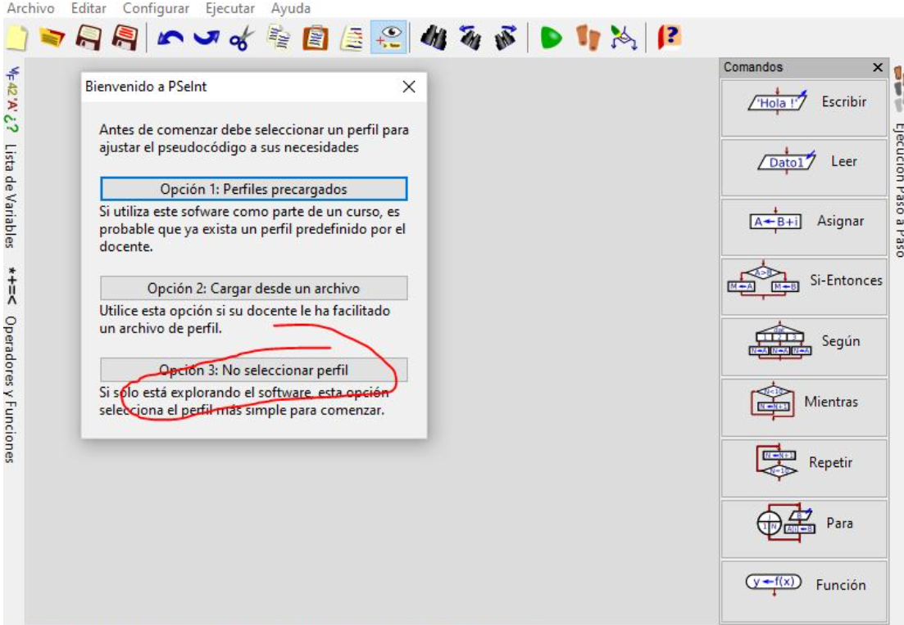
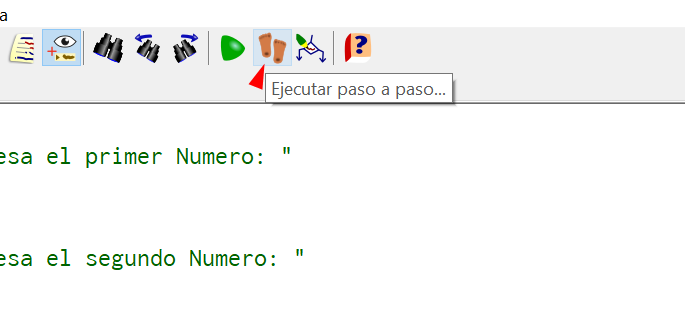
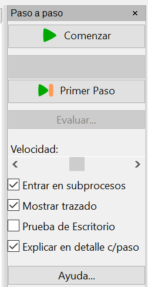
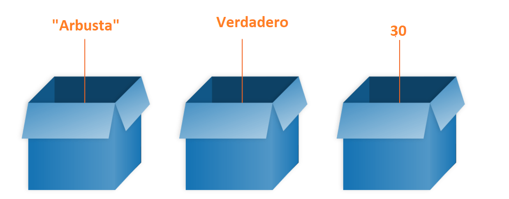
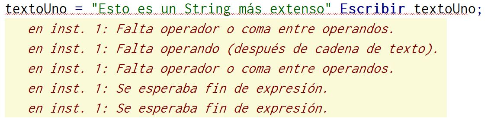

# Programación (Fundamentos y Logica)
# Lección 4:

* Introducción
* PSeInt
* Instalación
* Herramientas
* Click derecho
* Paso a paso
* Variables,
* Datos (pseint)
* Asignación
* Reglas (en Javascript)
* Punto y coma
* Leer
* Concatenación
* Práctica
* TIP


## Introducción
Conoceremos los fundamentos de programación utilizando un pseudocódigo llamado PSeInt

Ventajas
Estos conceptos te servirán para la mayoría de los lenguajes de programación.
Pasar estas definiciones a Javascript será muy fácil.
Nos ayuda visualmente como pensar como programadores.
Esta guía tiene ejemplos orientados a Javascript.

## PSeInt
PSeInt es una herramienta para asistir a estudiantes en sus primeros pasos en programación. Mediante un simple e intuitivo pseudolenguaje en español (complementado con un editor de diagramas de flujo), le permite centrar su atención en los conceptos fundamentales de la algoritmia computacional, minimizando las dificultades propias de un lenguaje y proporcionando un entorno de trabajo con numerosas ayudas y recursos didácticos.

## Instalación

http://pseint.sourceforge.net/



Una vez instalado seleccionar la opción 3:

## Herramientas
Tenemos las típicas herramientas como nuevo, abrir, etc. Las importantes serán:

Corregir Indentado: Las buenas prácticas indican que un código bien indentado será de fácil lectura.
Ejecutar
Ejecutar paso a paso
Dibujar diagrama de flujo

## Click derecho
Sobre el texto "Algoritmo" damos click derecho nos saldrá una opción de definición, lo cual es sumamente útil para revisar conceptos:

Algoritmo: Una secuencia de instrucciones es una lista de una o más instrucciones y/o estructuras de control. Comienza con la palabra clave Algoritmo (o alternativamente Proceso, son sinónimos) seguida del nombre del programa, luego le sigue una secuencia de instrucciones y finaliza con la palabra FinAlgoritmo (o FinProceso).
Ejemplo SUMA:

```javascript
// este es el ejemplo más simple de esta ayuda,
// toma dos numeros, los suma y muestra el resultado

Algoritmo Suma


    // para cargar un dato, se le muestra un mensaje al usuario
    // con la instrucción Escribir, y luego se lee el dato en
    // una variable (A para el primero, B para el segundo) con
    // la instrucción Leer

    Escribir "Ingrese el primer numero:"
    Leer A

    Escribir "Ingrese el segundo numero:"
    Leer B


    // ahora se calcula la suma y se guarda el resultado en la
    // variable C mediante la asignación (<-)

    C <- A+B


    // finalmente, se muestra el resultado, precedido de un
    // mensaje para avisar al usuario, todo en una sola
    // instrucción Escribir

    Escribir "El resultado es: ",C

FinAlgoritmo
```

## Paso a paso
Ejecutar opción paso a paso y seleccionar explicar en detalle c/paso:

Opcion paso a paso



Configuracion



## Variables
Primero tenemos que conocer el concepto de variable:

En programación una variable es un espacio de memoria el cual nos servirá para almacenar un tipo de dato con un valor correspondiente.
Imagina como una caja que guarda un tipo de dato/valor.



## Datos (pseint)
Los tipos posibles son NUMERO/REAL/ENTERO, LOGICO, CARACTER/TEXTO/CADENA.

NUMERO, NUMERICO y REAL son sinónimos para el tipo de datos numérico básico, que puede almacenar tanto números reales como enteros.

LOGICO sólo puede tomar los valores VERDADERO y FALSO, pero cuando se lee una variable ya definida como lógica, el usuario puede ingresar también las abreviaciones V y F, o 0 y 1.

CARACTER, TEXTO y CADENA son sinónimos para definir variables de tipo carácter. Estas pueden contener cero, uno o más caracteres arbitrarios y no tienen una longitud máxima.

```javascript
Algoritmo super_suma
	textoUno = "Esto es un String";
	Escribir textoUno;

	numeroUno = 25;
	Escribir numeroUno;

	estadoActual = Verdadero;
	Escribir estadoActual;
FinAlgoritmo
```
## Asignación

El signo = en Javascript se conoce como asignación (permite almacenar un valor a una variable).
Se evalúa la expresión de la derecha y luego se le asigna el resultado a la variable de la izquierda. 

## Reglas (en Javascript)

Al momento de declarar una variable recuerda:

Javascript es un lenguaje sensible a mayúsculas y minúsculas.
No es lo mismo "NombreUsuario" a "nombreUsuario".

No use guiones bajos al comienzo de los nombres de las variables — esto se usa en ciertas construcciones de JavaScript para significar cosas específicas, por lo que puede resultar confuso.

No uses números al comienzo de las variables. Esto no está permitido y provoca un error.

Una convención segura a seguir es la llamada "minúscula mayúsculas intercaladas" (Camel case) 🐫.

## Punto y coma

El punto y coma indica el final de una sentencia, pero Javascript lo detecta automáticamente, por ende puedes o no colocarlo. A excepción del siguiente ejemplo:




## Leer


La instrucción Leer permite ingresar información desde el ambiente.
Si una variable no existe, se crea durante la lectura. Si la variable existe se pierde su valor anterior ya que tomará el valor nuevo, razón por la cual se dice que la lectura es "destructiva" (destruye el valor que tenía previamente la variable).

```javascript
Imprimir "Ingrese su nombre"
leer nombreUsuario
Imprimir "Bienvenido: " , nombreUsuario
```

## Concatenación

Nos sirve para unir una o más variables, también lo puedes mezclar con diferentes tipos de datos.

## Práctica

```javascript
Algoritmo super_suma

	Imprimir "Ingrese su nombre"
	leer nombreUsuario
	Imprimir "Bienvenido: " , nombreUsuario

	Imprimir "Ingrese primero número"
	leer primerNumero

	Imprimir "Ingrese segundo número"
	leer segundoNumero

	resultadoSuma = primerNumero + segundoNumero

	Imprimir nombreUsuario , " el resultado es: " , resultadoSuma

FinAlgoritmo

```

## TIP

Las variables traten de hacerlas lo más descriptivas posibles, este es un programa simple pero a futuro tendrás cientos de variables declaradas. Además si alguien revisa el código también se da una idea de lo que está ocurriendo.

