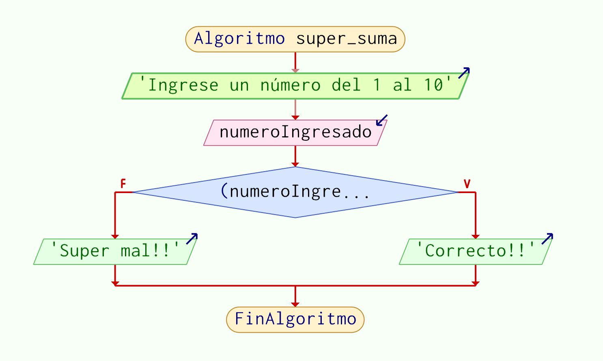
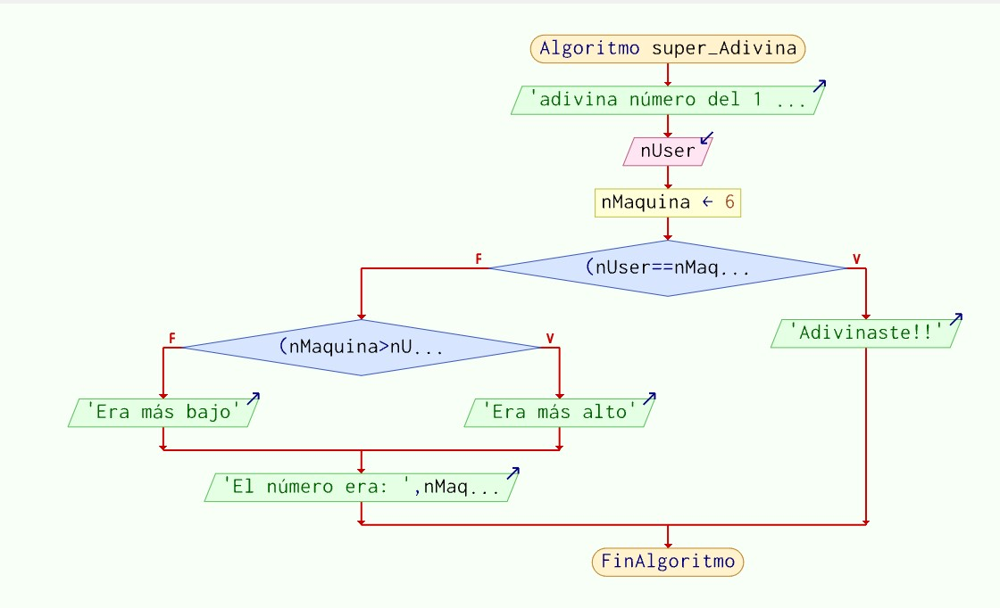
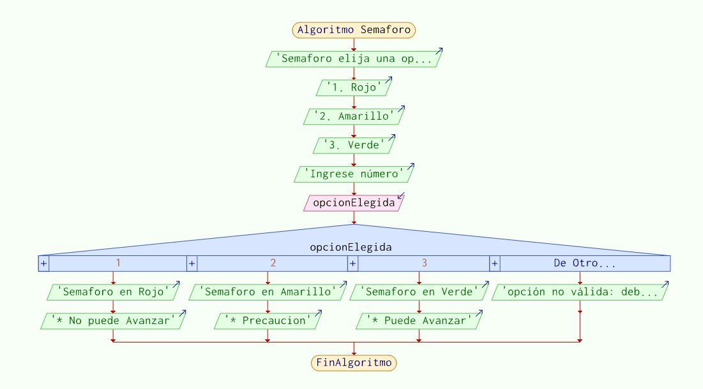
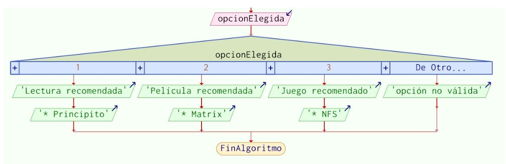
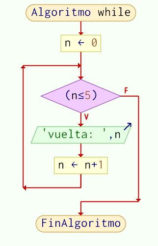
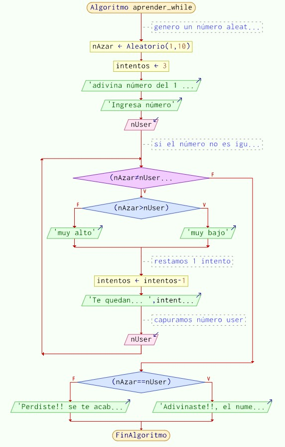

# Programación (Fundamentos y Logica)
# Lección 5:

* Operadores
* Operadores Aritméticos
* Operadores relacionales
* Operadores lógicos
* Estructuras de control
* if/else (si/no)
* Ejercicio: super_Adivina
* switch (segun)
* Ejercicio: libro-pelicula o juego
* while 
* Ejercicio: Adivinar el Numero Aleatorio

## Operadores
Existen diferentes tipos de operadores

Operadores Aritméticos o Algebraicos o Matemáticos.
Operadores de Comparación / Relacionales.
Operadores lógicos.

## Operadores Aritméticos

En programación y matemáticas, los operadores aritméticos son aquellos que manipulan los datos de tipo numérico, es decir, permiten la realización de operaciones matemáticas (sumas, restas, multiplicaciones, etc.).. más info(opens new window)

Adición: Suma dos números juntos.

```javascript
resultado = 20 + 10;
Mostrar resultado;
```

Resta: Resta el numero de la derecha del de la izquierda.

```javascript
resultado = 20 - 10;
Mostrar resultado;
```

Multiplicación: Multiplica dos números juntos.

```javascript
resultado = 20 * 10;
Mostrar resultado;

```

División: Divide el número de la izquierda por el de la derecha.

```javascript
resultado = 20 / 10;
Mostrar resultado;
```

Sobrante (también llamado módulo): Retorna el restante después de dividir el número de la izquierda en porciones enteras del de la derecha.

```javascript
resultado = 10 % 3;
Mostrar resultado;
```

## Operadores relacionales

Los operadores relacionales o comparación definidos por PseInt son idénticos a los que definen las matemáticas: mayor que (>), menor que (<), mayor o igual (>=), menor o igual (<=), igual que (==) y distinto de (!=, <>).

```javascript
resultado = 10 > 11;
Mostrar resultado;
```

```javascript
resultado = 10 <= 10;
Mostrar resultado;
```

```javascript
resultado = 10 == 11;
Mostrar resultado;
```

```javascript
resultado = 10 <> 11;
Mostrar resultado;
```
## Operadores lógicos

Los operadores lógicos se usan para combinar dos valores Booleanos y devolver un resultado verdadero, falso o nulo. Los operadores lógicos también se denominan operadores Booleanos.

&& (y): Si los dos son verdaderos devuelve verdadero.
|| (o): Basta con que uno sea verdadero para que devuelva verdadero.
! (no): Negación

```javascript
resultado = 20 > 10 y 50 < 100
Mostrar resultado
```

```javascript
resultado = !Verdadero
Mostrar resultado
```

## Estructuras de control

En lenguajes de programación, las estructuras de control permiten modificar el flujo de ejecución de las instrucciones de un programa.

## Condicionales

if/else (Si ocurre algo, haz esto, sino, haz lo esto otro...)
?: operador ternario (Operador ternario: Equivalente a If/else , método abreviado.)
switch (Estructura para casos específicos: Similar a varios If/else anidados.)
Repetitivas o iterativas

while
do... while
for

## if/else (si/no)

Un if en programación se utiliza para evaluar una expresión condicional: si se cumple la condición (es verdadera), ejecutará un bloque de código.

Ejemplo: (Probalo en PSeint)

Codigo:

```javascript
Algoritmo super_suma
	Mostrar "Ingrese un número del 1 al 10"
	Leer numeroIngresado
	Si ( numeroIngresado <= 10 ) Entonces
		Escribir 'Correcto!!'
	SiNo
		Escribir 'Super mal!!'
	FinSi
FinAlgoritmo
```

Diagrama:



-------------------------------------------------

## Ejercicio:

Realizar un programa que llamado super_Adivina:

A) Pida un numero del 1 al 10;

B) Guardar ese numero en la variable: nUser

C) Crear la variable nMaquina y asignarle el valor numerico 6

utilizar la estructura si/entonces

D) Si nUser es igual al nMaquina
Mostrar "Adivinaste!!"

E) Si el nMaquina es mayor al nUser
Mostrar "Era más alto"

F) SiNo
Mostrar "Era más bajo"

G) De no adivinar ademas del mensaje "Era más alto" o "Era más bajo", 
	Mostrar "El número era: " , nMaquina

Codigo: Crear, Guardar y enviar el archivo.

Diagrama:



## switch (segun)

Esta instrucción permite ejecutar opcionalmente varias acciones posibles, dependiendo del valor almacenado en una variable. Al ejecutarse, se evalúa el contenido de la variable y se ejecuta la secuencia de instrucciones asociada con dicho valor.

Ejemplo (Probalo en PSeint)

Codigo: 

```javascript
Algoritmo Semaforo
	Mostrar "Semaforo elija una opción:"
	Mostrar "1. Rojo"
	Mostrar "2. Amarillo"
	Mostrar "3. Verde"
	Mostrar "Ingrese número"
	
	Leer opcionElegida
	
	Segun opcionElegida
		1:
			Escribir "Semaforo en Rojo"
			Escribir "* No puede Avanzar"
		2:
			Escribir "Semaforo en Amarillo"
			Escribir "* Precaucion"
		3:
			Escribir "Semaforo en Verde"
			Escribir "* Puede Avanzar"
		De Otro Modo:
			Escribir "opción no válida: debe ingresar un numero del 1 al 3"
	FinSegun
	
FinAlgoritmo
```

Diagrama: 



-------------------------------------------------
Ejercicio

Codigo: Crear un programa que pida un numero
y le recomiende a la persona un libro-pelicula o juego segun la opción indicada.

Diagrama:



## While

Crea un bucle o loop que ejecuta una sentencia especificada mientras cierta condición se evalúe como verdadera.

Ejemplo1 (Probalo en PSeint)

```javascript
Algoritmo while
	n <- 0
	Mientras (n<=5) Hacer
		Escribir 'vuelta: ' , n
		n <- n+1
	FinMientras
FinAlgoritmo
```




Aleatorio:
Utilizo la palabra reservada  "Aleatorio" y entre parentesis escribo los rangos.
ese numero aleatorio lo guardo en una variable llamada numAzar

```javascript
Algoritmo super_suma
	numAzar = Aleatorio(1,10)
	Escribir numAzar
FinAlgoritmo
```
----------------------------------------------------------

Ejercicio 

El ejercicio tendrá el nombre de aprender_while. pasos: 

A) genero un número aleatorio lo guardo en la variable "nAzar" 

B) creo la variable "intentos" y le paso como dato el numero 3

C) Escribo en pantalla: "adivina número del 1 al 10, tienes: " , intentos (aca hago referencia a la variable) , " intentos" 

D) Pido un numero 

E)el numero lo guardo en la variable nUser 


G)

si el número(nAzar) no es igual entrará al while
si el numero (nAzar) es mayor : Mostrar "muy bajo"
si el numero (nAzar) es menor : Mostrar "muy alto"


H) Restamos 1 intento 


I) Mostrar "Te quedan... " , intentos (aca hago referencia a la variable) , " intentos!" 


J) capturamos número elegido por user: Leer nUser antes de finalizar el while


 K) Por fuera del while: Si.- el numero nAzar es igual al nUser Mostrar "Adivinaste!!, el numero era" , nAzar 


L) SiNo.-"Perdiste!! se te acabaron los intentos! el numero era: " nAzar

Diagrama: 




